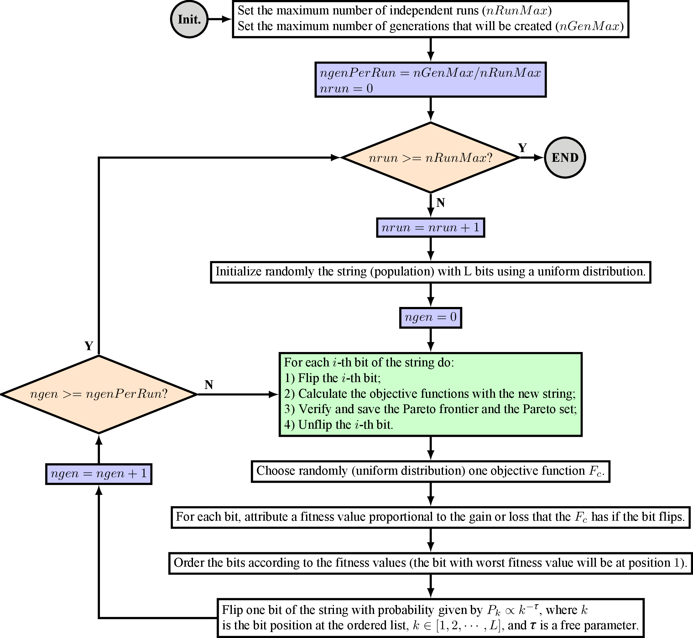

MGEOcpp - A C++ Library for MGEO
================================

**MGEOcpp** is a C++ library that implements the Multiobjective Generalized
Extremal Optimization algorithm. It was coded by [Ronan Arraes Jardim
Chagas](http://www.inpe.br/ete/dse/ronan) at [INPE](http://www.inpe.br)
(National Institute for Space Research, *in portuguese*).

MGEO
----

GEO is an evolutionary algorithm developed at [INPE](http://www.inpe.br) [1]
that, along with its multiobjective version (M-GEO), has already been
successfully applied to a myriad of optimization engineering problems:

* Thermal design [2];
* Structural optimization [3];
* Satellite layout design [4];
* Spacecraft attitude controller for a rigid-flexible satellite [5];
* Design satellite constellations that minimize the average and the maximum
  revisit time over a region of interest [6];
* Given an analysis interval and a region of interest, design satellite
  constellations that minimize the number of spacecraft, the mean orbital
  altitude, and the area not accessible [7].

The flowchart of MGEO is [7]:



The library **MGEOcpp** codes in C++ the algorithm presented in the MGEO
flowchart. **MGEOcpp** is currently used in the following software:

* **OrbGEO** - An Orbit Selection Tool for Satellite Constellations Using the
  Multiobjective Generalized Extremal Optimization (MGEO) Algorithm [7];

**Note:** MGEOcpp contains ***only templates***. Thus, it is not supposed to add
any bits to the binary unless an instance of the class MGEO is created.

Usage
-----

The minimal working code for **MGEOcpp** is:

```
MGEO<N, nb, nf, Scalar> mgeo1(tau, ngenMax, runMax, rng_seed);
mgeo1.confDesignVars({listOfBits}, {listOfMinimumValues}, {listOfMaximumValues}, {listOfNames});
mgeo1.objectiveFunctions = &objectiveFunctions;
mgeo1.run();
mgeo1.sortParetoFrontier();
mgeo1.printParetoFrontier();
```
where

| Parameter                              | Description                                               | Type                                   | Example                                 |
| -------------------------------------- | --------------------------------------------------------- |:--------------------------------------:|:---------------------------------------:|
| N                                      | Number of design variables.                               | Integer                                | 2                                       |
| nb                                     | Total number of bits in the string.                       | Integer                                | 16                                      |
| nf                                     | Number of objective functions.                            | Integer                                | 2                                       |
| Scalar                                 | Type of the design variables (OPTIONAL, default = double) | A C++ numeric type                     | double                                  |
| tau                                    | Parameter to set the determinism of the search.           | Double                                 | 3.0                                     |
| ngenMax                                | Maximum number of generations that will be created.       | Integer                                | 30000                                   |
| runMax                                 | Maximum number of independent runs.                       | Integer                                | 50                                      |
| rng_seed                               | Seed for the random number generator (OPTIONAL).          | Integer                                | 0                                       |
| listOfBits                             | Number of bits for each design variable.                  | List of Integers                       | {8, 8}                                  |
| listOfMinimumValues                    | Minimum values for each design variable.                  | List of Doubles                        | {-10.0, -5.0}                           |
| listOfMaximumValues                    | Maximum values for each design variable.                  | List of Doubles                        | {5.0, 2.0}                              |
| listOfNames                            | List with the design variable names (OPTIONAL).           | List of Strings                        | {"Variable 1", "Variable 2"}            |

and **objectiveFunctions** must be a user-defined function that receives the
design variables and computes the objective functions. It must be defined as
follows:

```
bool objectiveFunctions(Scalar *vars, Scalar *f)
{
    1) Read the design variables vars[0], vars[1], vars[2], ..., vars[N]
    2) Compute the objective functions f[0], f[1], f[2], ..., f[nf]
    3) Return false if the objective function evaluation was not performed
       correctly or true otherwise.
}
```

For more information, see the example file
[mgeocpp_testcases.cpp](./src/mgeocpp_testcases.cpp).

Compilers <a name="Compilers"></a>
---------

**MGEOcpp** must be compiled with a compile that supports:

* C++11 standards (REQUIRED);
* OpenMP (OPTIONAL, see ENABLE_OPENMP flag at [CMakeLists.txt](CMakeLists.txt)).

The supported compiler is **g++ 4.8.1**.

Please, let me know if you could successfully compile **MGEOcpp** with other
compilers.

Dependencies <a name="Dependencies"></a>
------------

The following packages are necessary to compile **MGEOcpp**:

* **autoconf**
* **automake**
* **make**
* **cmake**
* A **C++ compiler** that supports the **C++11 standards**

How to Compile
--------------

First, clone the source tree:

```
git clone https://github.com/ronisbr/mgeocpp.git
cd mgeocpp
```

Then, to compile the source code using the default example, execute:

```
cmake ./
make
```

Finally, the executable file **mgeocpp_testcases** should be created.

**Note:** if the C++ does not support OpenMP, then the option ENABLE_OPENMP in
CMakeLists.txt file must be ***disabled***.

Operational Systems
-------------------

**MGEOcpp** should work on any operational system that has support for the
[required packages](#Dependencies). However it has
been only tested on **openSUSE 13.1 Linux**.

Please, let me know if you could successfully run **MGEOcpp** in other
operational systems.

License
-------

This project is released under the **BSD 3-Clause License** (see
[LICENSE](./LICENSE) file).

Authors
-------

[Ronan Arraes Jardim Chagas](http://www.inpe.br/ete/dse/ronan) created MGEOcpp.

References
----------

[1] F. L. de Sousa, F. M. Ramos, P. Paglione, and R. M. Girardi, "**New
stochastic algorithm for design optimization**," *AIAA Journal*, vol. 41, no. 9,
pp. 1808-1818, 2003.

[2] A. P. C. Cuco, F. L. de Sousa, V. V. Vlassov, and A. J. da Silva Neto,
"**Multi-objective design optimization of a new space radiator**," *Optimization
and Engineering*, vol. 12, no. 3, pp. 393-406, 2011.

[3] F. L. de Sousa and W. K. Takahashi, **Generalized extremal optimization
applied to three-dimensional truss design**," in *18th Internation Congress of
Mechanical Enginering*. Ouro Preto, MG, Brazil: Associação Brasileira de
Engenharia e Ciências Mecânicas, 2005.

[4] A. P. C. Cuco, F. L. de Sousa, and A. J. S. Neto, "**A multi-objective
methodology for spacecraft equipment layouts**," *Optimization and Engineering
(Online)*, 2014.

[5] I. Mainenti-Lopes, L. C. G. Souza, and F. L. de Sousa, "**Design of a
nonlinear controller for a rigid-flexible satellite using multi-objective
generalized extremal optimization with real codification**," *Shock and
Vibration*, vol. 19, pp. 947-956, 2012.

[6] R. L. Galski, F. L. de Sousa, and F. M. Ramos, "**Application of a new
multiobjective evolutionary algorithm to the optimum design of a remote sensing
satellite constellation**," in *5th International Conference of Inverse Problems
in Engineering: Theory and Practice*, Cambridge, UK, 2005.

[7] R. A. J. Chagas, R. L. Galski, F. L. de Sousa, "**OrbGEO - An Orbit
Selection Tool for Satellite Constellations Using the Multiobjective Generalized
Extremal Optimization (MGEO) Algorithm**", in *6th International Conference on
Systems & Concurrent Engineering for Space Applications*, Stuttgart, Germany,
2014 (*in press*).


